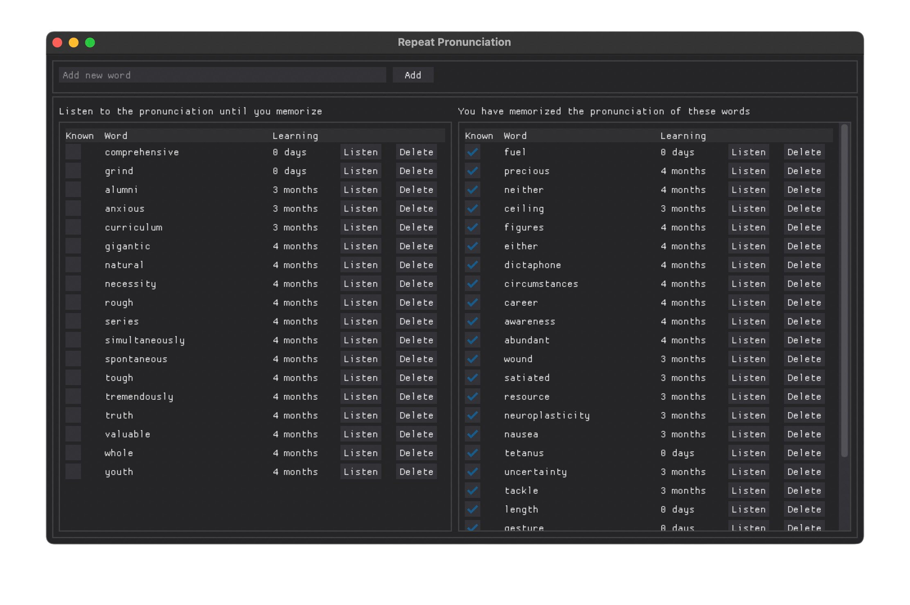
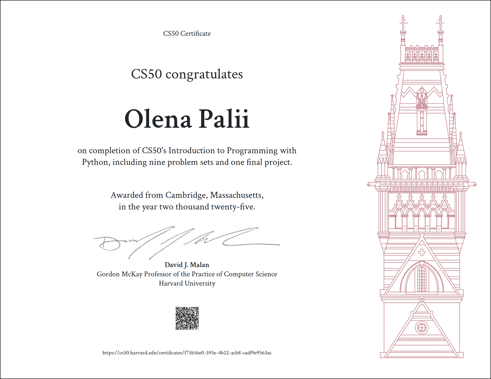

# Repeat Pronunciation

[Final Project](https://cs50.harvard.edu/python/project/) for CS50’s Introduction to Programming with Python.

This Python project helps to improve English pronunciation by listening correct pronunciation until you memorize it. Check the words you have learned to move them to the list of known words. The displayed period helps you understand how long you need to repeat the word to remember its pronunciation.

The project was inspired by my own list of "hard" words, because I didn't want to search them online each time.



## Getting Started

Run the program using:

```bash
python project.py
```

The GUI launches automatically and is the primary interface, though users can manually edit `words.csv` or access downloaded `.mp3` files in the `audio/` folder.

## Robust Design

The app is built to avoid errors and ensure smooth interaction:

* Ignores empty or duplicate words
* Removes invalid characters
* Handles missing or malformed `words.csv`
* Replaces date parsing errors with today date

## Project Structure

* `project.py` – main logic
* `gui.py` – GUI implementation using dearpygui
* `word.py` – defines the `Word` class and CSV operations
* `audio.py` – manages download, playback, and deletion of audio files
* `test_*.py` – test files for respective modules

## Features

### Load words

The program loads words from `words.csv`, expecting columns:

* `word` – text (up to 50 characters)
* `added` – (optional) date word was added (`YYYY-MM-DD`)
* `learned` – (optional) date word was learned

If the "word" column is missing, the first column is used instead.

### Save words

All words are saved back to the `words.csv` file after closing the program, `words.csv` file is overriden every time.

### Add words

Users can add new words via an input field. Pressing Enter or clicking "Add" saves the word with today’s date. Invalid characters are removed, and duplicates are ignored.

### Lists of words

The GUI displays:

* Unknown words (not yet learned pronunciation) on the left
* Known words (already learned pronunciation) on the right

Each row includes:

- "Known" checkbox that allows to move a word between 2 lists
- The word itself
- The learning period (time taken to learn it)
- "Listen" button to play pronunciation
- "Delete" button to remove the word

Toggling the "Known" checkbox moves it to the top of the respective list and updates added / learned date to today date.

### Audio Pronunciation

Clicking "Listen" plays the word's audio using `.mp3` files generated and downloaded with `gTTS`. If file already exists it won't be downloaded again.

### Deleting Words

The "Delete" button removes a word from all lists and deletes its associated audio file if it exists.

## Development Notes

* Initial setup on macOS required configuring a Python virtual environment.
* I faced issues with `tkinter` on macOS, so the GUI was built with `dearpygui`, which worked seamlessly.
* Still needed to read `dearpygui` docs to fix all bugs.
* An early attempt to use `pyttsx3` for speech output caused program termination due to conflicts with the GUI library.
* `pyttsx3` was installed with more than 100 `pyobjc` dependencies, so I found how to manage dependencies via `requirements.txt` and reset the virtual environment.
* Other speech tool `subprocess.run(["say", word])` was great for macOS but not supported by Windows / Linux
* Finally, `gTTS` was chosen for audio generation and `pygame` for playback, ensuring cross-platform compatibility.
* Writing tests helped me to catch few bugs and I needed to slightly refactor code to make it testable.

## CS50P Certificate


